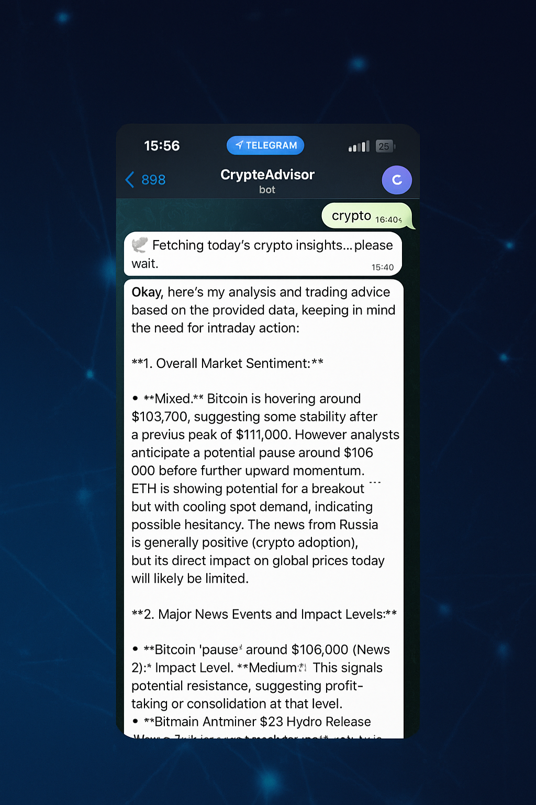

# 🤖 Crypto Adviser Bot

An AI-powered Telegram bot that delivers daily crypto trading advice using real-time price data and news.

---

## 💡 Features

- 🪙 Fetches real-time price data from CoinGecko  
- 📰 Retrieves the latest crypto news from CryptoPanic  
- 🤖 Uses Gemini AI to generate intraday trading suggestions  
- 📬 Sends insights directly to your Telegram chat  
- 🕒 Supports hourly scheduled updates  

---

## 📱 Demo  


---

## 🧠 Flow Overview

1. User sends the word `crypto` to the Telegram bot.  
2. The bot triggers the `run_analysis()` function.  
3. It fetches:
   - Market prices from CoinGecko  
   - Top news from CryptoPanic  
4. Formats the data and sends a prompt to Gemini AI.  
5. Gemini AI returns actionable investment advice.  
6. The bot replies in Telegram with the insights.  


---

## 🚀 Setup Instructions

1. **Install dependencies**
    ```bash
    pip install -r requirements.txt
    ```

2. **Set up your config**
    - Add your API keys and Telegram bot token.

3. **Run the Telegram bot**
    ```bash
    python main.py
    ```

---

## 🔒 Security

- Do **not** push `config_secret.py` to GitHub.
- Use `.gitignore` to exclude it.
- A sample is provided as `config_template.py`.

---

## 📦 Requirements

- `requests`  
- `google-generativeai`  
- `schedule`  
- `python-telegram-bot`

---

## ✨ Credits

Created by an AI-powered crypto enthusiast 🚀
