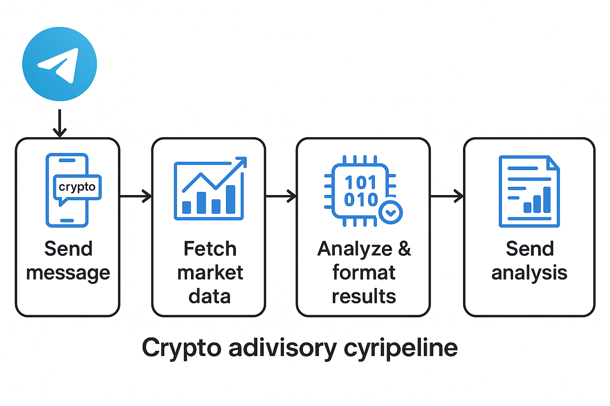

# 🤖 Crypto Adviser Bot

This is an AI-powered Telegram bot that gives daily crypto trading advice based on live price data and news.

---

## 💡 Features

- 🪙 Fetches real-time price data from CoinGecko
- 📰 Retrieves latest crypto news from CryptoPanic
- 🤖 Uses Gemini AI to generate intraday trading suggestions
- 📬 Sends results directly to your Telegram chat
- 🕒 Supports hourly scheduled updates

---

## 🧠 Flow Overview

1. User sends the word `crypto` to the Telegram bot.
2. Bot triggers `run_analysis()` function.
3. It fetches:
   - Market price from CoinGecko
   - Top news from CryptoPanic
4. Formats data and sends a prompt to Gemini AI.
5. Gemini returns actionable investment advice.
6. The bot replies with the insights in Telegram.



---

## 🚀 Setup Instructions

1. **Install dependencies**
    ```bash
    pip install -r requirements.txt
    ```

2. **Set up your config**
    - Create a `config_secret.py` file based on the provided `config_template.py`.
    - Add your API keys and Telegram bot token.

3. **Run the Telegram bot**
    ```bash
    python telegram_listener.py
    ```

4. **Optional: Schedule auto-analysis**
    ```bash
    python scheduler.py
    ```

---

## 🔒 Security

- Do not push `config_secret.py` to GitHub.
- Use `.gitignore` to exclude it.
- Example included as `config_template.py`.

---

## 📦 Requirements

- `requests`
- `google-generativeai`
- `schedule`
- `python-telegram-bot`

---

## ✨ Credits

Created by an AI-powered crypto enthusiast 🚀
